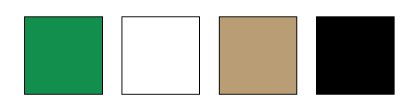

# Anpassningar för SvenskaLag

Här finns en del kodexempel som används på SIK Orienterings sida hos SvenskaLag.
Koden används på sidor/annonser/nyheter där man kan välja "Text & Egen HTML".

## SIK färger

* Grön: #00904a https://imagecolorpicker.com/color-code/00904a
* Vit: #ffffff https://imagecolorpicker.com/color-code/ffffff
* Beige: #ba9d71 https://imagecolorpicker.com/color-code/ba9d71
* Svart: #000000 https://imagecolorpicker.com/color-code/000000

